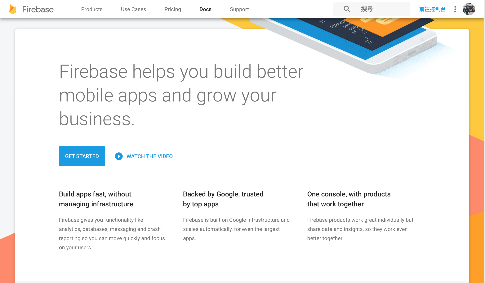
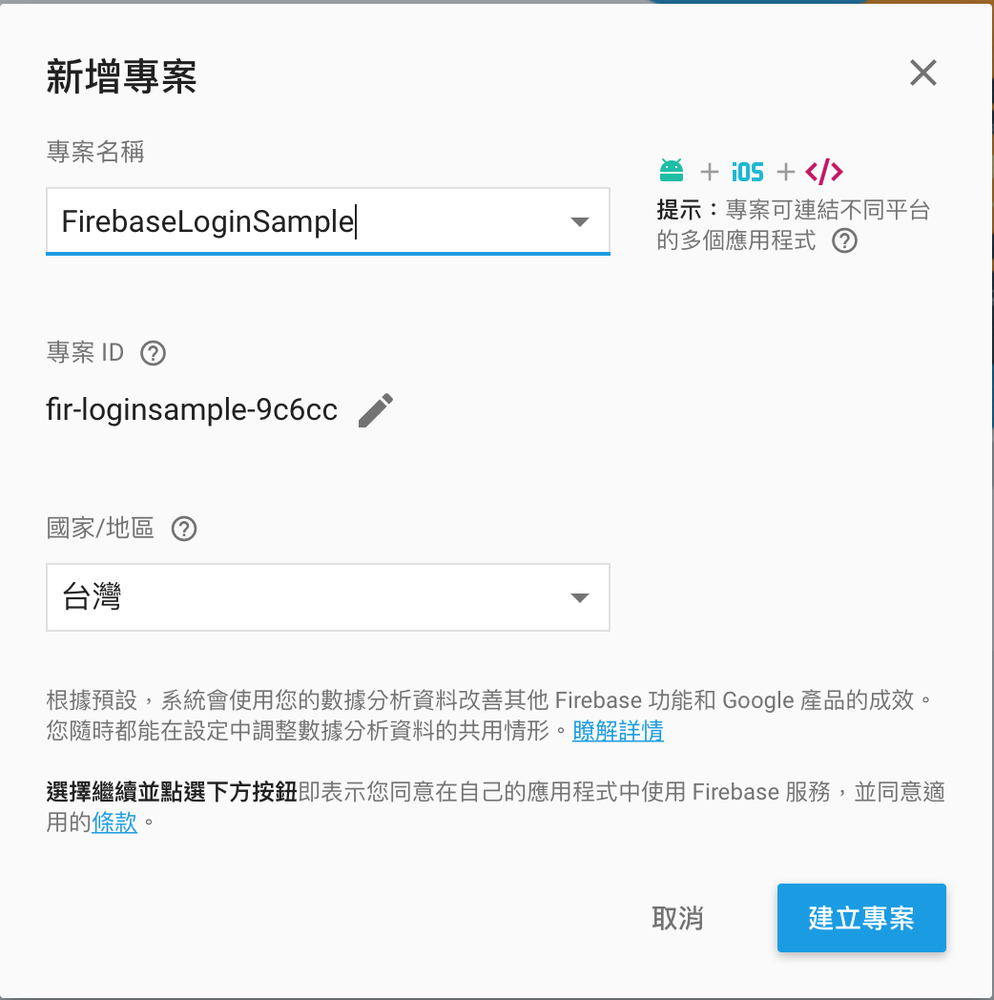
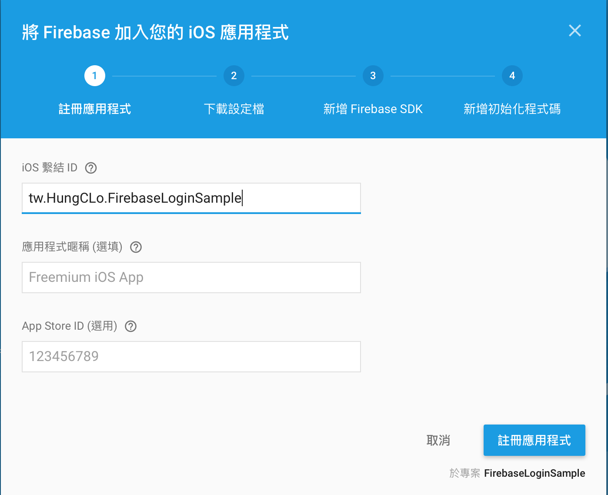
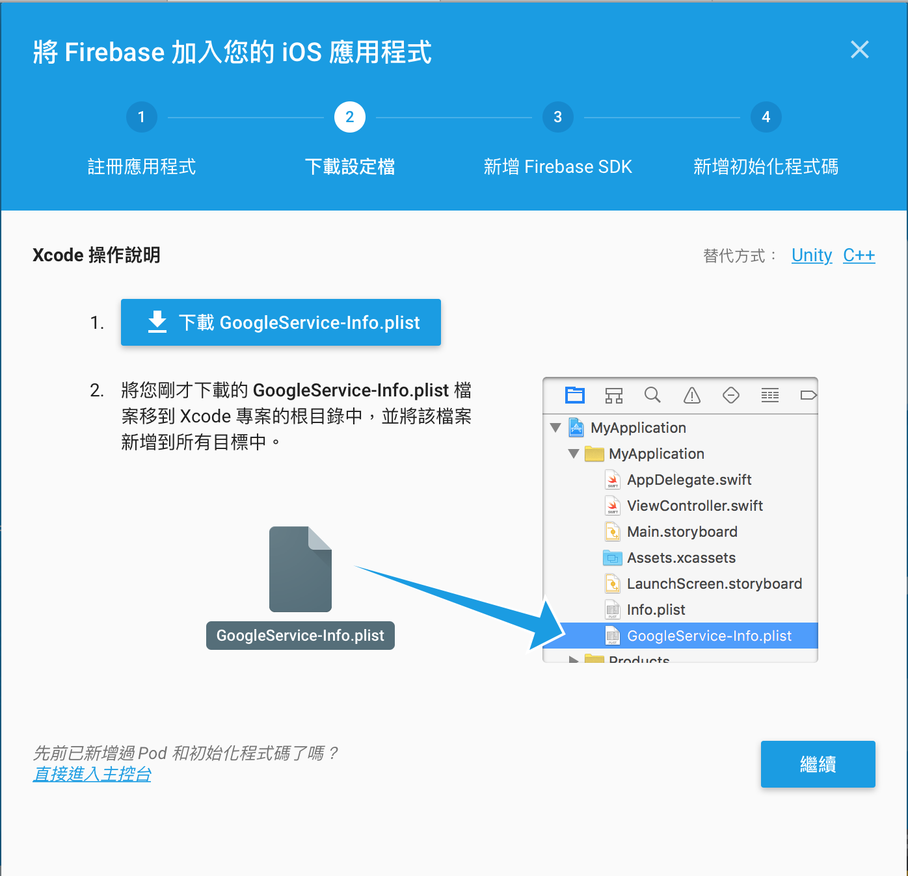
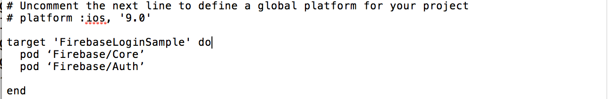
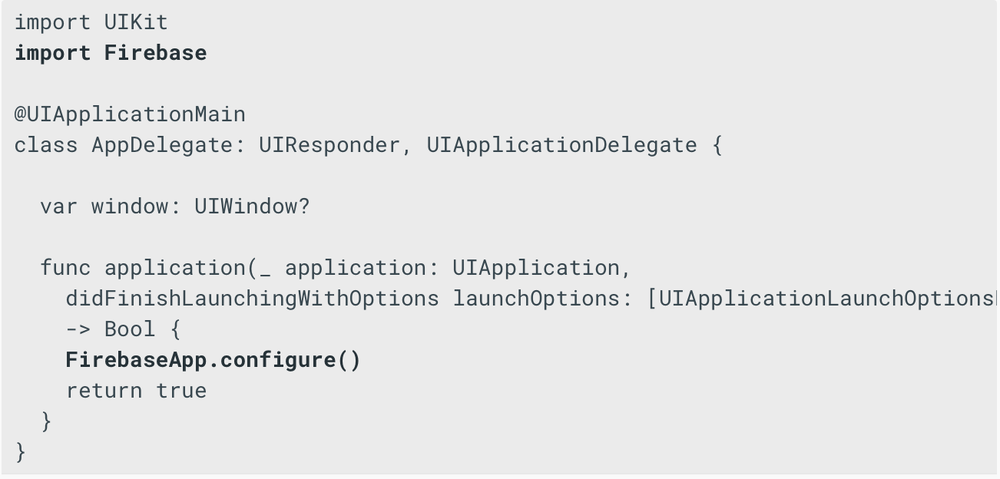
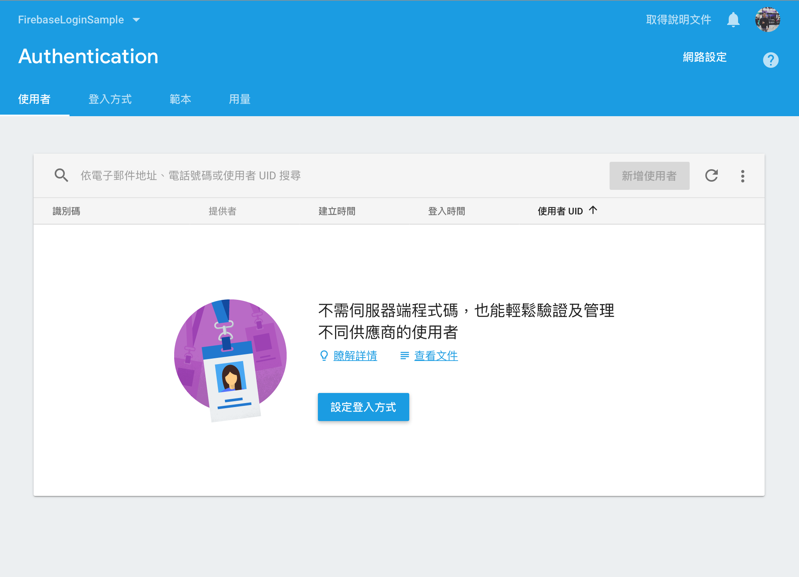
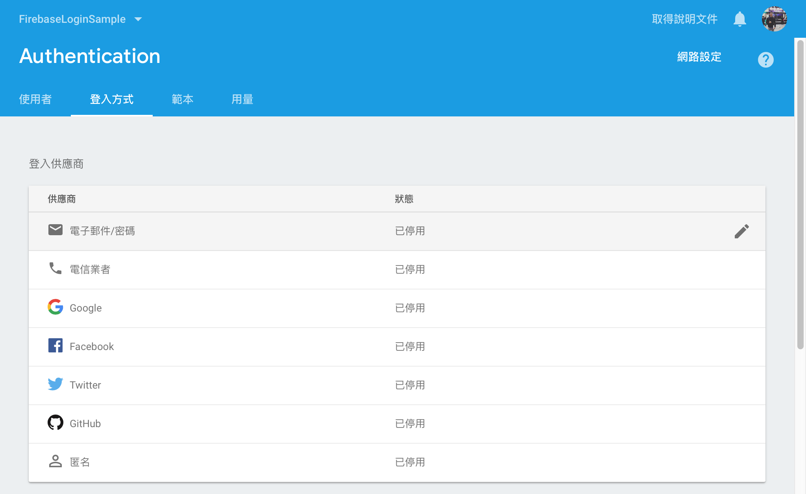
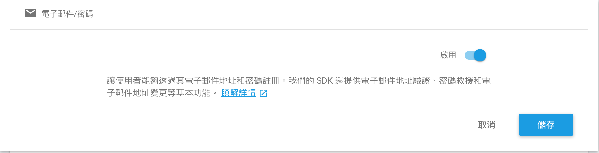

# FirebaseLoginSample

 

## 1. 註冊Firebase，新增專案

1. 使用Google帳號，並登入[Firebase](https://firebase.google.com)

 

2. 點擊 Get started -> 建立新專案

 

3. 設定專案名稱，選擇國家 -> 建立專案

 

4. 選取，將 Firebase 加入您的iOS應用程式

 

5. 將專案的 bundle id 和 Firebase 作連結

iOS 繫結 ID 欄位必須和 XCode 專案上的 bundle id 一致 -> 點選新增應用程式

 

6. 新增 GoogleService-Info.plist 到 iOS 專案的根目錄裡

 

7. 新增Pod

    7.1 下指令 *pod init* 來新增PodFile

    7.2 在podfile 裡頭新增 1. Firebase/Core 2. Firebase/Auth

    7.3 

 

- 下指令 *pod install* 來安裝Firebase SDK

8. 在AppDelegate 初始化Firebase，並在有用到Firebase的地方都要import Firebase, import FirebaseAuth

 

9. 啟用Firebase Authentication 服務

    9.1 
    
    9.2 
    
    9.3 

    9.4 
    
     
    
## 2. 在iOS專案實作註冊

